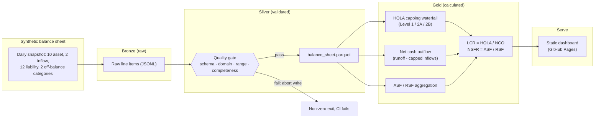

# Basel III Liquidity Reporting Pipeline (LCR / NSFR)

[](https://github.com/vabhishek8/basel-liquidity-reporting-pipeline/actions/workflows/pipeline.yml)

A regulatory liquidity reporting pipeline that computes the Liquidity
Coverage Ratio (LCR) and Net Stable Funding Ratio (NSFR) for a synthetic
Australian bank's daily balance sheet, structurally consistent with APRA
Prudential Standard APS 210 and the underlying BCBS238 (LCR) and BCBS295
(NSFR) standards.

**[Live dashboard →](https://vabhishek8.github.io/basel-liquidity-reporting-pipeline/)**

Built as the third project in a series that deliberately covers three
different data-engineering postures for banking: [azure-medallion-weather-pipeline](https://github.com/vabhishek8/azure-medallion-weather-pipeline)
(cost-optimized serverless), [aml-transaction-monitoring-pipeline](https://github.com/vabhishek8/aml-transaction-monitoring-pipeline)
(private-endpoint compliance detection), and this one: a deterministic
regulatory calculation with a hard reporting deadline and a
segregation-of-duties requirement, which is a different job than either
sibling project and closer to what a data engineer sitting inside a
bank's regulatory reporting or treasury function actually owns.

**This is a portfolio project, not a production regulatory tool.** The
runoff, ASF, and RSF factors below are illustrative and simplified; a
real APRA return carries counterparty, product, and behavioural nuance
not modelled here. No real balance-sheet data is used, all figures are
synthesized.

---

## Why this project exists

AML detection is a statistical problem: did the model catch the
pattern? Liquidity reporting is a different problem entirely: did the
calculation reproduce the exact number a regulator expects, given a
fixed, publicly-specified formula? Getting a deterministic calculation
provably right, including the parts of the specification that are easy
to misread, is a different and equally real skill from building a
detector, and it is the more common day job: most people working in
bank regulatory reporting are implementing formulas correctly against a
deadline, not training models.

This project is scoped around that:

- Can the HQLA capping rules be implemented as specified, not as they
  first appear from a casual reading? (See "a real bug this caught" below.)
- Does the pipeline distinguish a 30-day cash-flow shock (LCR) from a
  1-year structural funding shock (NSFR) correctly, given the same
  underlying event?
- Where does a maker-checker control belong in the architecture, not
  just in a policy document?

---

## Architecture



## Calculation correctness (measured, not asserted)

Every ratio in this project is checked against a hand-calculated
expected value, not just spot-checked for plausibility. `tests/test_gold.py`
carries a minimal fixture with round numbers where the expected LCR and
NSFR are computed by hand in the test's own docstring, and the SQL is
asserted to match that value exactly.

| Check | Result |
|---|---|
| LCR formula matches hand calculation | Exact match |
| NSFR formula matches hand calculation | Exact match |
| Baseline day clears the 100% regulatory minimum on both ratios | Pass |
| Deposit-run scenario breaches LCR while NSFR stays healthy | Pass, by design (see below) |
| HQLA waterfall matches the correct sequential capping order, not a naive single cap | Pass, regression-guarded |

### A real bug this caught: the HQLA cap is two caps, not one

BCBS238 par 51 specifies the Level 2 asset cap as two nested rules:
Level 2B assets cannot exceed 15% of total HQLA, and total Level 2
(2A + 2B combined) cannot exceed 40% of total HQLA. A first, naive
implementation applied only the 40% total cap to the sum of Level 2A and
Level 2B, since that reading is what the summary version of the rule
sounds like at a glance. On a Level-2B-heavy portfolio (see the
`l2b_heavy` scenario in `src/generate_balance_sheet.py`), that naive
version overstates total HQLA by roughly $65 million, about 8%, because
it never applies the 15% Level 2B sub-cap before applying the 40% total
cap. The fix was to compute Level 2B's adjusted value first, capped
against Level 1, then combine with Level 2A and apply the total cap
second. `src/gold.py` keeps the naive version alongside the correct one,
not because it is used anywhere, but because
`tests/test_gold.py::test_hqla_waterfall_not_naive_single_cap` needs
something concrete to regress against.

### LCR and NSFR do not move together, and that is intentional

The `deposit_run` scenario cuts retail deposits by 20% and funds the
withdrawal from cash and government securities. LCR (a 30-day
cash-flow stress measure) drops from a healthy ~195% to below 100%,
a real breach. NSFR (a 1-year structural funding measure) barely moves,
because retail deposits still carry a favourable 90-95% Available
Stable Funding factor regardless of a short-term run assumption; NSFR
is measuring something structurally different from LCR, not a slower
version of the same thing. `tests/test_gold.py::test_deposit_run_breaches_lcr_but_not_nsfr`
asserts both halves of that behaviour, not just the breach.

---

## Production Azure mapping

`infra/main.bicep` deliberately makes a different set of infrastructure
calls than either sibling project, because this workload's shape is
different: a scheduled, predictable-size batch against a hard regulatory
deadline, with a segregation-of-duties requirement between the process
that produces a number and the person who approves its submission.

| Decision | Reasoning |
|---|---|
| Synapse **Dedicated SQL Pool** (DW100c), not Serverless | This is the opposite call from weather-pipeline, deliberately. Serverless suits sporadic, unpredictable-volume queries; a fixed nightly batch against a hard submission deadline benefits from reserved, predictable throughput instead. The pool is paused outside the batch window, so it is not billed 24/7, the same cost discipline as the other two projects, applied to a different demand curve. |
| Geo-redundant storage (GRS), not LRS/ZRS | The one project in the portfolio using GRS. A missed submission because of a regional outage during the reporting window is itself a compliance failure, not just a data-durability question. |
| Separate `pending-submission` and `submitted` containers | Models a maker-checker control: the pipeline (the "maker") can only write to `pending-submission`; moving data to `submitted` requires a separate, independently-authorized action. This is a real control, not a nice-to-have, most banking regulatory frameworks require the preparer and the approver of a submission to be different people. |
| Dedicated `audit-log` container, 365-day Log Analytics retention in prod | This is an audit trail for who approved what and when, not operational telemetry. |
| Private endpoints for storage and the Synapse workspace | Standard hardening; lighter-touch than the AML project's VNet-everywhere posture because this is submission data, not raw PII/transaction data. |

Validated with `bicep build` (0 errors, 0 warnings, 20 resources). Deploy it yourself:

```bash
az deployment group create \
  --resource-group rg-basel-liquidity-dev \
  --template-file infra/main.bicep \
  --parameters envName=dev alertEmail=you@example.com
```

---

## Running locally

```bash
python -m venv .venv && source .venv/bin/activate
pip install -r requirements.txt
python src/pipeline.py            # generate -> silver -> gold -> dashboard
PYTHONPATH=src pytest tests/ -v   # 23 tests: quality gate, generator invariants, golden calculations
open docs/index.html
```

## Repo layout

```
src/
  factors.py                  regulatory factor tables (HQLA levels, runoff, ASF/RSF)
  generate_balance_sheet.py   synthetic daily balance sheet, 3 engineered stress scenarios
  quality_checks.py           the silver quality gate
  transform.py                 bronze -> silver: parse, type, gate
  gold.py                       LCR/NSFR calculation engine, including the HQLA waterfall
  dashboard.py                   renders gold -> static Plotly HTML
  pipeline.py                     orchestrates all four stages
tests/                          23 pytest cases, including hand-verified golden calculations
infra/main.bicep                production Azure IaC: Dedicated SQL Pool, GRS storage, maker-checker containers
.github/workflows/               scheduled CI: test -> run -> commit refreshed gold data
```

## Stack

Python · pandas · DuckDB · Plotly · pytest · GitHub Actions · Bicep (Synapse Dedicated SQL Pool, ADLS Gen2 GRS, Data Factory, Key Vault RBAC, Log Analytics)

---

Built by [Abhishek Vadlamudi](https://abhishekvadlamudi.com), Senior BI Engineer
positioning toward Azure Data Engineering in financial services.
